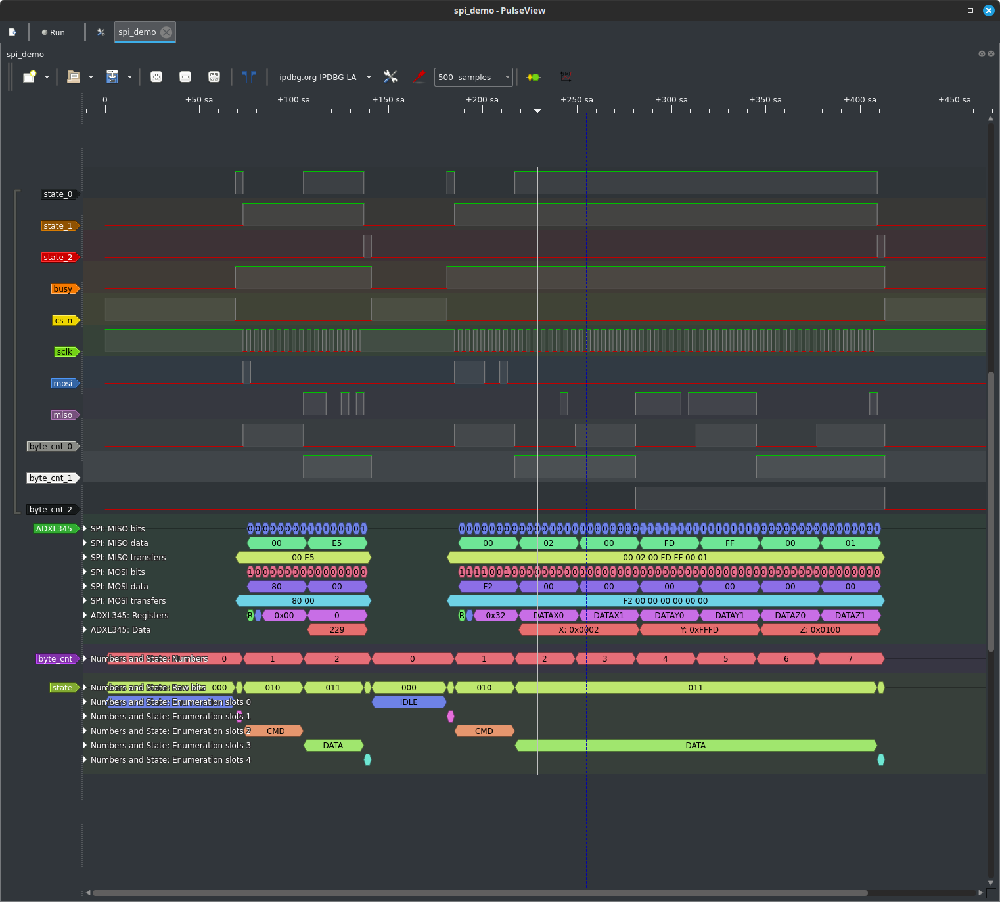
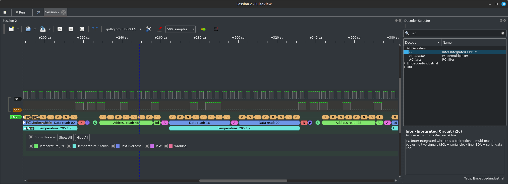
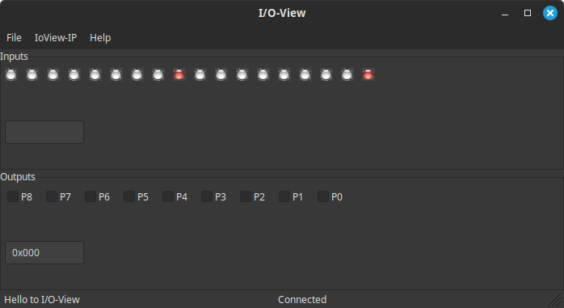
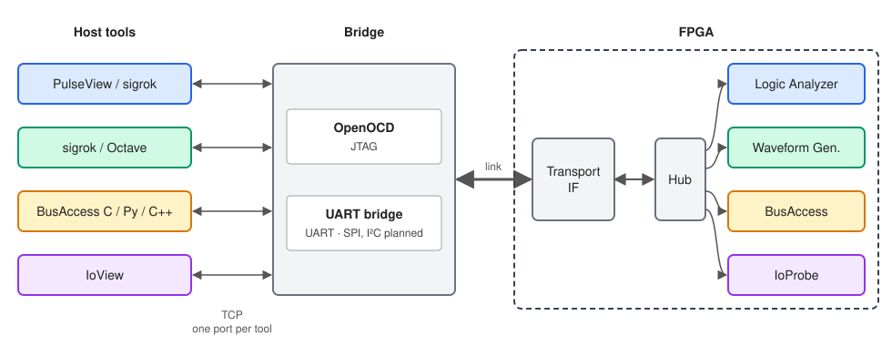

# IPDBG – IP Debugger for FPGAs

IPDBG is a vendor-independent, open source debugging toolkit for FPGAs.
It provides small debug cores that you instantiate in your design and
host-side tools that connect to them – over JTAG, UART or other links,
without requiring extra pins in most cases.

The same cores and the same host tools work on FPGAs from Lattice,
Intel/Altera, Efinix, Gowin, Microchip/Actel, AMD/Xilinx, Cologne Chip
and others, so your debug infrastructure stays the same when you switch
FPGA families.

## Features

**Logic Analyzer**
Capture internal signals with configurable triggers. Captures are displayed
and analysed in [sigrok](https://sigrok.org) / PulseView, which gives you
access to the full set of sigrok protocol decoders (SPI, I²C, UART, CAN, …)
and an enum decoder for showing FSM states by name.


*The enum decoder shows the states of an FSM by name, the SPI and ADXL345
decoders the transfers. Recorded with the [CoSim demo](sw/CoSim/README.md):
the Waveform Generator plays the signals, the Logic Analyzer captures them.*

The Logic Analyzer can also be controlled from your own programs through
the libsigrok C/C++ API or its Python bindings: configure triggers, start
captures and process the data further – for example, a spectrum analyzer
running FFTs on signals captured inside the FPGA.

**Waveform Generator**
Drive stimuli into your design, either from sigrok or from your own
programs using the C library and the C++, Python and
[GNU Octave](https://octave.org) wrappers. For example, generate a
waveform in Octave and send it to the generator:

```octave
bytes = [0x91 0x16 0x00];  ack = [0 0 1];     % read address 0x48, 22.0 °C; NACK after last byte
scl = [1 1 1];  sda = [1 1 0];                % Idle, START (falling SDA while SCL high)
for k = 1:numel(bytes)
  for b = [bitget(bytes(k), 8:-1:1), ack(k)]  % MSB first, following ACK/NACK
    scl = [scl 0 1 1 0];  sda = [sda b b b b];
  end
end
scl = [scl 0 1 1 1];  sda = [sda 0 0 1 1];   % STOP (rising SDA while SCL high)
wave = scl + 2*sda;
WaveformGenerator;
wfg = WaveformGenerator.IpdbgWaveformGenerator();
wfg.open("127.0.0.1", "4243");
wfg.write(wave);
wfg.start();
wfg.close();
```

See the [WaveformGenerator documentation](sw/WaveformGenerator/README.md)
for the C API and the bindings.

Looped back to the Logic Analyzer, the result shows up in PulseView:


*An  I²C frame generated in Octave, played by the Waveform Generator,
captured by the Logic Analyzer and decoded in PulseView.*

**BusAccess**
A bus master core for AXI4-Lite, Wishbone, AHB, APB, Avalon and RISC-V DMI.
Read and write registers of your design from a PC using the C library or
the C++, Python and Octave bindings – ideal for scripted tests and bring-up.
See the [BusAccess documentation](sw/BusAccess/README.md).

**IoView / IoProbe**
Read and set individual signals interactively: IoProbe is the IP core in
the FPGA, IoView the host application.


*IoView reading inputs and setting outputs of an IoProbe core.*

## Architecture



Each host tool talks to exactly one IP core in the FPGA, over its own
TCP port. A bridge forwards all of these connections over a single
physical link: OpenOCD for JTAG, a UART bridge for UART. In the FPGA, the
transport interface and the hub distribute the traffic to the cores.

Because the host tools only see TCP, they work the same regardless of
the FPGA family and the physical link – and several tools can be used
at the same time, for example capturing with the Logic Analyzer while
poking registers with BusAccess.

### Custom transports

The protocol between bridge and FPGA is simple, so adding your own
transport takes little effort. For example, a microcontroller running
lwIP can act as the bridge: it accepts the TCP connections from the host
tools and forwards the data to the IPDBG hub in a memory-mapped FPGA –
no JTAG involved at all.

## Supported transports and devices

### JTAG (vendor user scan chain – no extra pins)

| Vendor          | Families |
|-----------------|----------|
| Lattice         | ECP2, ECP3, ECP5, Certus |
| Intel           | Arria II, Arria II GZ, Arria V, Arria V GZ, Cyclone III, Cyclone IV, Cyclone IV E, Cyclone V, Cyclone 10 LP, MAX V, MAX 10, Stratix III, Stratix V |
| Efinix          | Trion, Titanium |
| Gowin           | GW1N |
| Microchip/Actel | ProASIC3 |
| AMD/Xilinx      | Spartan-3, Spartan-6, Spartan-7, Virtex-4, Virtex-6, 7 Series (Artix-7, Kintex-7, Virtex-7), Zynq-7000, UltraScale¹, UltraScale+¹ |

¹ UltraScale and UltraScale+ use the same `BSCANE2` primitive as the
7 Series and are expected to work, but have seen less testing so far.
Feedback is welcome.

### Generic JTAG on user I/Os

For any other FPGA: a soft JTAG interface on 4 regular I/O pins.

### UART

Uses 2 user I/Os.

### Planned

- SPI (e.g. for Cologne Chip GateMate)
- I²C (e.g. for Lattice iCE40)

## Quick start

### Try it without hardware

The co-simulation in [`sw/CoSim`](https://github.com/IPDBG/IPDBG/tree/master/sw/CoSim)
replaces the FPGA and the JTAG adapter with a [GHDL](https://github.com/ghdl/ghdl)
simulation. OpenOCD connects to it through its `remote_bitbang` adapter –
everything above that is identical to real hardware:

```
 PulseView ── TCP ──▶ OpenOCD ── remote_bitbang ──▶ GHDL simulation
                                                    (JTAG TAP + IPDBG cores)
```

You need GHDL, [sigrok-cli](https://sigrok.org/wiki/Sigrok-cli) or
[PulseView](https://sigrok.org/wiki/PulseView), and OpenOCD with the
IPDBG server and the `remote_bitbang` adapter
(`./configure --enable-remote-bitbang` if your build lacks it). The
configuration needs OpenOCD 1.0.0 or later, or OpenOCD from git including
commit 52ea420 (*ipdbg: simplify command chains*).

```
cd sw/CoSim
make            # build the simulation
./CoSim         # start the simulation
```

In a second terminal:

```
openocd -f ipdbg_JtagSim.cfg
```

Then connect to the Logic Analyzer, either in PulseView
(*Connect to Device* → driver *IPDBG Logic Analyzer*, interface TCP,
host `127.0.0.1`, port `4242`) or with sigrok-cli:

```
sigrok-cli --driver=ipdbg-la:conn=tcp-raw/127.0.0.1/4242 --scan
```

The demo design provides all four tools, each on its own port:

| Port | Tool               |
|------|--------------------|
| 4242 | Logic Analyzer     |
| 4243 | Waveform Generator |
| 4244 | IoView             |
| 4245 | BusAccess          |

The Logic Analyzer records the output of the Waveform Generator, so you
can generate a waveform and capture it right away. The
[CoSim README](sw/CoSim/README.md) describes the demo design and shows an
example for each tool.

### On real hardware

The only thing that changes is the lower end of the chain: instead of the
simulation you instantiate the IPDBG hub and the JTAG interface for your
FPGA family in your design, and OpenOCD uses your JTAG adapter instead of
`remote_bitbang`. The host tools stay exactly the same.

TODO: example for one common board.

## Repository layout

| Directory | Contents |
|-----------|----------|
| [`rtl/`](https://github.com/IPDBG/IPDBG/tree/master/rtl) | VHDL IP cores and transport interfaces |
| [`sw/BusAccess`](sw/BusAccess/README.md) | BusAccess library with C++, Python and Octave bindings |
| [`sw/WaveformGenerator`](sw/WaveformGenerator/README.md) | WaveformGenerator library with C++, Python and Octave bindings |
| [`sw/IoView`](sw/IoView) | IoView host application |
| [`sw/CoSim`](sw/CoSim/README.md) | Co-simulation with GHDL, try IPDBG without hardware |

The IPDBG server for JTAG is part of [OpenOCD](https://openocd.org),
the Logic Analyzer driver is part of [libsigrok](https://sigrok.org).

## License

- Hardware (`rtl/`): [CERN-OHL-W-2.0](https://ohwr.org/cern_ohl_w_v2.txt)
- Software (`sw/`): [MPL-2.0](https://www.mozilla.org/MPL/2.0/)

In short: you can use IPDBG in closed-source designs and products.
If you distribute a product that contains modified IPDBG files, the
modifications to those files must be made available – the rest of your
design stays yours. See the license texts for the binding terms.

## Contributing and support

Questions, bug reports and feature requests:
[GitHub Issues](https://github.com/IPDBG/IPDBG/issues).
Fixes and improvements are welcome as
[pull requests](https://github.com/IPDBG/IPDBG/pulls).
