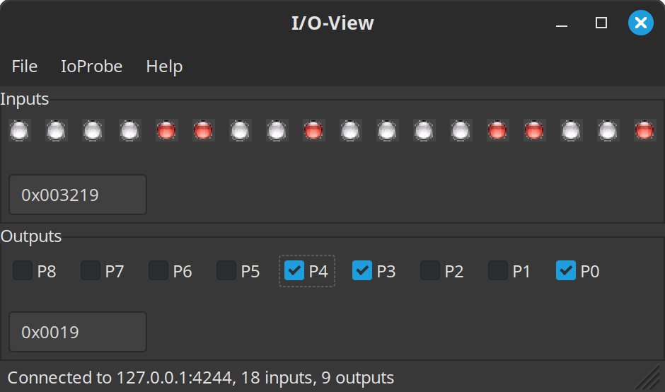

# IoView

Read and set individual signals of your FPGA design interactively.
IoView is the host application for the IoProbe core: it shows the probe
inputs as LEDs and sets the probe outputs with check boxes.

Part of [IPDBG](https://github.com/IPDBG/IPDBG).


*IoView reading inputs and setting outputs of an IoProbe core.*

## How it works

```
 PC                                           FPGA
┌─────────────┐   TCP   ┌─────────────┐   JTAG/…   ┌─────────┐     ┌─────────────┐
│ IoView      │ ──────► │ IPDBG host  │ ─────────► │ IoProbe │ ◄─► │ your design │
│             │         │ server      │            │ core    │     │             │
└─────────────┘         └─────────────┘            └─────────┘     └─────────────┘
```

IoView connects via TCP to an IPDBG host server, e.g. OpenOCD for JTAG.
IoProbe speaks the BusAccess protocol, so IoView uses the
[BusAccess library](../BusAccess/README.md). You can access an IoProbe core
from your own programs and scripts the same way, see
[Core identification](../BusAccess/README.md#core-identification).

After connecting, IoView queries the number of inputs and outputs from the
core; they are defined by the HDL, so IoView works with any IoProbe
configuration. It then reads the inputs 50 ms after each previous read.
Writing the outputs happens immediately when you change them.

## Requirements

* Linux, or Windows with [MSYS2](https://www.msys2.org) (MinGW-w64)
* wxWidgets 3.0 or later including development files, e.g. `wxGTK-devel`
  on Fedora, `libwxgtk3.2-dev` on Debian/Ubuntu,
  `mingw-w64-ucrt-x86_64-wxwidgets3.2-msw` on MSYS2 (UCRT64)
* GCC/G++ with C++17 support, GNU make

## Building

```sh
cd sw/IoView
make
```

This creates:

* Linux: `bin/Release/IoView`. It links `libBusAccess.so` and builds it
  first if needed (see the [BusAccess README](../BusAccess/README.md#building)).
  It finds the library on its own, so `LD_LIBRARY_PATH` is not needed.
* Windows: `bin/Release/IoView.exe`. The BusAccess library is compiled into
  the program, so no DLL has to be found at runtime.

wxWidgets is found with `wx-config`. To use another one, select it
explicitly, e.g. `make WX_CONFIG=wx-config-3.2`.

`make clean` removes the build output.

The Code::Blocks project `IoView.cbp` builds with the Makefile (target
*all*). On Windows, set the make program of the compiler in Code::Blocks to
the `make` of MSYS2 (*Settings → Compiler → Toolchain executables → Make
program*). The connection dialog can be edited there with wxSmith
(`wxsmith/ConnectionDialog.wxs`).

## Usage

1. Start the IPDBG host server, e.g. OpenOCD with the IPDBG server for the
   IoProbe core.
2. Start IoView and choose *IoProbe* → *Connect*.
3. Enter host and port of the IoProbe core. IoView suggests `127.0.0.1`
   and `4244`, the port of IoProbe in the [co-simulation](../CoSim/README.md#ioview)
   and the [Cmod S7 demo](../../rtl/demo/cmod-s7/README.md). IoView
   remembers host and port for the next start.

The window then shows:

| Part    | Content |
|---------|---------|
| Inputs  | One LED per input, the most significant input on the left, and the value in hex |
| Outputs | One check box per output, `P0` is output 0, and the value in hex. Enter a value in the text field and press Enter to set all outputs at once. |

The status bar shows host, port and the number of inputs and outputs.
*IoProbe* → *Disconnect* closes the connection.

After reset and after every connect, all outputs of the core are `0`.

## Error messages

| Message | Meaning |
|---------|---------|
| *… is a BusAccess bus master, not an IoProbe core* | The port belongs to a BusAccess bus master core. Use the [BusAccess library](../BusAccess/README.md) for it. |
| *… not a BusAccess core*, with the hint *An IoView core of an older IPDBG version?* | The core at this port does not speak the BusAccess protocol. Before IoProbe, the core for IoView was `IoViewTop`; replace it with `IoProbeTop` from `rtl/IoProbe`. |
| *timeout: no answer from the core within 5000 ms* | The core did not answer, e.g. because the port belongs to another IPDBG core (Waveform Generator, Logic Analyzer) or the FPGA is not configured. |

After an error IoView closes the connection. Errors while connected, e.g.
a timeout while reading the inputs, are reported the same way.

## The IoProbe core

The HDL core is in [`rtl/IoProbe`](../../rtl/IoProbe/README.md)
(`IoProbeTop`); its README describes the ports and how to add it to your
design.

## License

[MPL-2.0](https://www.mozilla.org/MPL/2.0/)
